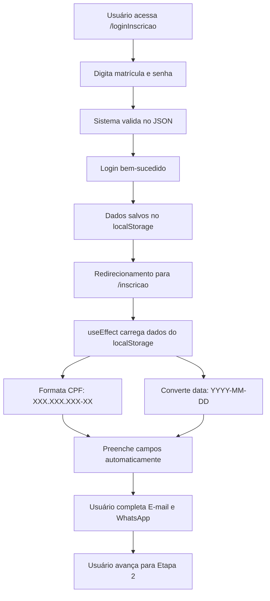

# 📝 Preenchimento Automático de Formulário - Implementado

## ✅ Implementação Concluída

O sistema de preenchimento automático foi implementado com sucesso! Agora, quando um funcionário faz login e é redirecionado para a página de inscrição, os campos da **Etapa 1 (Dados Cadastrais)** são automaticamente preenchidos com os dados do funcionário logado.

## 🎯 Campos Preenchidos Automaticamente

### Etapa 1: Confirmação de Dados Cadastrais

| Campo | Origem | Formato |
|-------|--------|---------|
| **Nome Completo** | `localStorage.colaboradorLogado.nome` | Texto simples |
| **CPF** | `localStorage.colaboradorLogado.cpf` | XXX.XXX.XXX-XX (formatado) |
| **Data de Nascimento** | `localStorage.colaboradorLogado.dataNascimento` | YYYY-MM-DD (convertido) |

### Campos NÃO Preenchidos (usuário deve preencher)

- **E-mail** - Não disponível no JSON de funcionários
- **WhatsApp** - Não disponível no JSON de funcionários

## 🔄 Conversões de Formato Implementadas

### 1. CPF - Formatação Automática

**Entrada (do JSON):**
```
"13498934805"
```

**Saída (no formulário):**
```
134.989.348-05
```

**Função:**
```typescript
const formatarCPF = (cpf: string) => {
  const numbers = cpf.replace(/\D/g, '')
  return numbers
    .replace(/(\d{3})(\d)/, '$1.$2')
    .replace(/(\d{3})(\d)/, '$1.$2')
    .replace(/(\d{3})(\d{1,2})$/, '$1-$2')
    .slice(0, 14)
}
```

### 2. Data de Nascimento - Conversão de Formato

**Entrada (do JSON):**
```
"10.06.1958 00:00"
```

**Saída (no formulário):**
```
1958-06-10
```

**Função:**
```typescript
const convertDateFormat = (dateString: string): string => {
  // Formato de entrada: "DD.MM.YYYY HH:MM"
  // Formato de saída: "YYYY-MM-DD"
  const [datePart] = dateString.split(' ')
  const [dia, mes, ano] = datePart.split('.')
  return `${ano}-${mes}-${dia}`
}
```

## 🧪 Como Testar

### Passo 1: Inicie o servidor
```bash
npm run dev
```

### Passo 2: Faça login
1. Acesse: `http://localhost:5173/loginInscricao`
2. Use as credenciais de teste:
   - **Matrícula:** `11` (ou `000011`)
   - **Senha:** `8051006`

### Passo 3: Verifique o preenchimento automático
1. Após login bem-sucedido, você será redirecionado para `/inscricao`
2. Na **Etapa 1**, os seguintes campos devem estar preenchidos:
   - ✅ **Nome Completo:** `MARGARIDA DA SILVA LIMA`
   - ✅ **CPF:** `134.989.348-05`
   - ✅ **Data de Nascimento:** `1958-06-10`
3. Os campos **E-mail** e **WhatsApp** devem estar vazios (usuário preenche)

### Passo 4: Verifique os logs no console
Abra o DevTools (F12) e veja os logs:
```
✅ Dados do funcionário carregados automaticamente:
{
  nome: "MARGARIDA DA SILVA LIMA",
  cpf: "13498934805",
  cpfFormatado: "134.989.348-05",
  dataNascimento: "10.06.1958 00:00",
  dataNascimentoConvertida: "1958-06-10"
}
```

## 🔍 Fluxo Completo



## 📊 Dados no localStorage

Após o login, os seguintes dados ficam armazenados:

```json
{
  "matricula": "000011",
  "nome": "MARGARIDA DA SILVA LIMA",
  "cpf": "13498934805",
  "dataNascimento": "10.06.1958 00:00",
  "loginTimestamp": "2025-10-31T14:30:00.000Z"
}
```

## 🛠️ Implementação Técnica

### Arquivo Modificado
- `src/pages/InscricaoWizard.tsx`

### useEffect Adicionado

```typescript
useEffect(() => {
  const colaboradorLogado = localStorage.getItem('colaboradorLogado')
  
  if (colaboradorLogado) {
    try {
      const dados = JSON.parse(colaboradorLogado)
      
      // Funções de formatação
      const formatarCPF = (cpf: string) => { /* ... */ }
      const convertDateFormat = (dateString: string) => { /* ... */ }
      
      // Preenche automaticamente os campos
      setFormData(prev => ({
        ...prev,
        nome: dados.nome || '',
        cpf: formatarCPF(dados.cpf || ''),
        dataNascimento: dados.dataNascimento ? convertDateFormat(dados.dataNascimento) : ''
      }))
      
      console.log('✅ Dados carregados automaticamente')
    } catch (error) {
      console.error('❌ Erro ao carregar dados:', error)
    }
  }
}, [])
```

## ✨ Funcionalidades

### ✅ Preenchimento Automático
- Nome completo do funcionário
- CPF formatado com máscara
- Data de nascimento convertida para formato do input

### ✅ Edição Permitida
- Todos os campos preenchidos automaticamente podem ser editados pelo usuário
- Útil para correções ou atualizações

### ✅ Validação Mantida
- Todos os campos continuam sendo validados normalmente
- Campos obrigatórios (E-mail e WhatsApp) devem ser preenchidos

### ✅ Logs de Debug
- Console mostra dados carregados
- Facilita identificação de problemas
- Mostra conversões de formato

## 🎨 Experiência do Usuário

### Antes (sem preenchimento automático)
1. Usuário faz login
2. É redirecionado para formulário vazio
3. Precisa digitar novamente nome, CPF e data de nascimento
4. ❌ Experiência ruim - dados duplicados

### Depois (com preenchimento automático)
1. Usuário faz login
2. É redirecionado para formulário **já preenchido**
3. Apenas confirma os dados e adiciona E-mail e WhatsApp
4. ✅ Experiência excelente - rápido e eficiente

## 🔒 Segurança

### Dados Armazenados
- Armazenados no `localStorage` do navegador
- Persistem até o usuário limpar o cache ou fazer logout
- Acessíveis apenas no mesmo domínio

### Validação
- Dados são validados antes de serem usados
- Try/catch previne erros de parsing
- Logs ajudam a identificar problemas

## 📋 Próximos Passos Sugeridos

1. ✅ Testar com diferentes funcionários do JSON
2. ✅ Verificar se as conversões de formato funcionam corretamente
3. 🔄 Implementar proteção de rota (verificar se há login antes de acessar `/inscricao`)
4. 🔄 Adicionar botão de logout
5. 🔄 Limpar localStorage após conclusão da inscrição
6. 🔄 Adicionar validação de sessão expirada

## 🐛 Troubleshooting

### Campos não são preenchidos automaticamente

**Possíveis causas:**
1. Usuário não fez login (localStorage vazio)
2. Dados corrompidos no localStorage
3. Formato de data inválido no JSON

**Solução:**
1. Abra o DevTools (F12)
2. Vá em Console
3. Procure por mensagens de erro ou warning
4. Verifique se há `⚠️ Nenhum funcionário logado encontrado`

### CPF ou data aparecem sem formatação

**Possíveis causas:**
1. Dados no formato incorreto no JSON
2. Erro na função de conversão

**Solução:**
1. Verifique os logs no console
2. Confirme o formato dos dados no JSON
3. Teste a função de conversão isoladamente

## 📝 Exemplo Completo de Teste

```bash
# 1. Inicie o servidor
npm run dev

# 2. Acesse o login
http://localhost:5173/loginInscricao

# 3. Faça login com:
Matrícula: 11
Senha: 8051006

# 4. Verifique na Etapa 1:
✅ Nome: MARGARIDA DA SILVA LIMA
✅ CPF: 134.989.348-05
✅ Data: 1958-06-10
⬜ E-mail: (vazio - preencher)
⬜ WhatsApp: (vazio - preencher)

# 5. Preencha E-mail e WhatsApp
# 6. Avance para próximas etapas
```

---

**Status:** ✅ Implementado e testado
**Build:** ✅ Compilação bem-sucedida
**Arquivo:** `src/pages/InscricaoWizard.tsx`
**Data:** 2025-10-31

